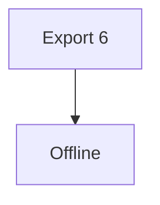
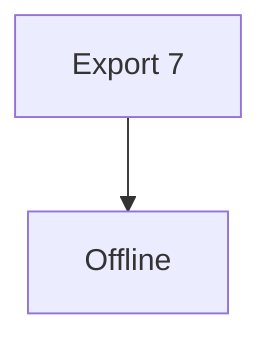
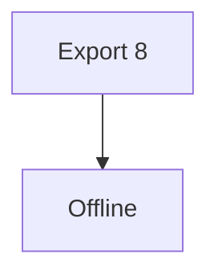
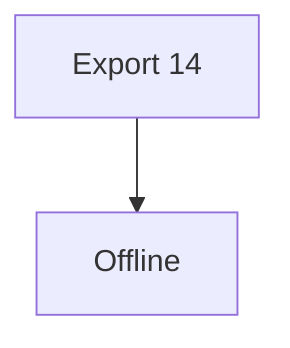
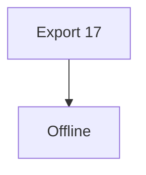

# Export F block 0

**Strong**, ~~deleted~~, [link](https://example.invalid/page), and `inline code`.

| Left | Right |
| --- | --- |
| alpha | beta |

- [x] checked task
- [ ] unchecked task

$E=mc^2$

$$
\int_0^1 x^2\,dx = \frac{1}{3}
$$

```swift
let matrixValue = 42
```


# Export F block 1

**Strong**, ~~deleted~~, [link](https://example.invalid/page), and `inline code`.

| Left | Right |
| --- | --- |
| alpha | beta |

- [x] checked task
- [ ] unchecked task

$E=mc^2$

$$
\int_0^1 x^2\,dx = \frac{1}{3}
$$

```swift
let matrixValue = 42
```


# Export F block 2

**Strong**, ~~deleted~~, [link](https://example.invalid/page), and `inline code`.

| Left | Right |
| --- | --- |
| alpha | beta |

- [x] checked task
- [ ] unchecked task

$E=mc^2$

$$
\int_0^1 x^2\,dx = \frac{1}{3}
$$

```swift
let matrixValue = 42
```


# Export F block 3

**Strong**, ~~deleted~~, [link](https://example.invalid/page), and `inline code`.

| Left | Right |
| --- | --- |
| alpha | beta |

- [x] checked task
- [ ] unchecked task

$E=mc^2$

$$
\int_0^1 x^2\,dx = \frac{1}{3}
$$

```swift
let matrixValue = 42
```


# Export F block 4

**Strong**, ~~deleted~~, [link](https://example.invalid/page), and `inline code`.

| Left | Right |
| --- | --- |
| alpha | beta |

- [x] checked task
- [ ] unchecked task

$E=mc^2$

$$
\int_0^1 x^2\,dx = \frac{1}{3}
$$

```swift
let matrixValue = 42
```


# Export F block 5

**Strong**, ~~deleted~~, [link](https://example.invalid/page), and `inline code`.

| Left | Right |
| --- | --- |
| alpha | beta |

- [x] checked task
- [ ] unchecked task

$E=mc^2$

$$
\int_0^1 x^2\,dx = \frac{1}{3}
$$

```swift
let matrixValue = 42
```


# Export F block 6

**Strong**, ~~deleted~~, [link](https://example.invalid/page), and `inline code`.

| Left | Right |
| --- | --- |
| alpha | beta |

- [x] checked task
- [ ] unchecked task

$E=mc^2$

$$
\int_0^1 x^2\,dx = \frac{1}{3}
$$

```swift
let matrixValue = 42
```




# Export F block 7

**Strong**, ~~deleted~~, [link](https://example.invalid/page), and `inline code`.

| Left | Right |
| --- | --- |
| alpha | beta |

- [x] checked task
- [ ] unchecked task

$E=mc^2$

$$
\int_0^1 x^2\,dx = \frac{1}{3}
$$

```swift
let matrixValue = 42
```




# Export F block 8

**Strong**, ~~deleted~~, [link](https://example.invalid/page), and `inline code`.

| Left | Right |
| --- | --- |
| alpha | beta |

- [x] checked task
- [ ] unchecked task

$E=mc^2$

$$
\int_0^1 x^2\,dx = \frac{1}{3}
$$

```swift
let matrixValue = 42
```




# Export F block 9

**Strong**, ~~deleted~~, [link](https://example.invalid/page), and `inline code`.

| Left | Right |
| --- | --- |
| alpha | beta |

- [x] checked task
- [ ] unchecked task

$E=mc^2$

$$
\int_0^1 x^2\,dx = \frac{1}{3}
$$

```swift
let matrixValue = 42
```


# Export F block 10

**Strong**, ~~deleted~~, [link](https://example.invalid/page), and `inline code`.

| Left | Right |
| --- | --- |
| alpha | beta |

- [x] checked task
- [ ] unchecked task

$E=mc^2$

$$
\int_0^1 x^2\,dx = \frac{1}{3}
$$

```swift
let matrixValue = 42
```


# Export F block 11

**Strong**, ~~deleted~~, [link](https://example.invalid/page), and `inline code`.

| Left | Right |
| --- | --- |
| alpha | beta |

- [x] checked task
- [ ] unchecked task

$E=mc^2$

$$
\int_0^1 x^2\,dx = \frac{1}{3}
$$

```swift
let matrixValue = 42
```


# Export F block 12

**Strong**, ~~deleted~~, [link](https://example.invalid/page), and `inline code`.

| Left | Right |
| --- | --- |
| alpha | beta |

- [x] checked task
- [ ] unchecked task

$E=mc^2$

$$
\int_0^1 x^2\,dx = \frac{1}{3}
$$

```swift
let matrixValue = 42
```


# Export F block 13

**Strong**, ~~deleted~~, [link](https://example.invalid/page), and `inline code`.

| Left | Right |
| --- | --- |
| alpha | beta |

- [x] checked task
- [ ] unchecked task

$E=mc^2$

$$
\int_0^1 x^2\,dx = \frac{1}{3}
$$

```swift
let matrixValue = 42
```


# Export F block 14

**Strong**, ~~deleted~~, [link](https://example.invalid/page), and `inline code`.

| Left | Right |
| --- | --- |
| alpha | beta |

- [x] checked task
- [ ] unchecked task

$E=mc^2$

$$
\int_0^1 x^2\,dx = \frac{1}{3}
$$

```swift
let matrixValue = 42
```




# Export F block 15

**Strong**, ~~deleted~~, [link](https://example.invalid/page), and `inline code`.

| Left | Right |
| --- | --- |
| alpha | beta |

- [x] checked task
- [ ] unchecked task

$E=mc^2$

$$
\int_0^1 x^2\,dx = \frac{1}{3}
$$

```swift
let matrixValue = 42
```


# Export F block 16

**Strong**, ~~deleted~~, [link](https://example.invalid/page), and `inline code`.

| Left | Right |
| --- | --- |
| alpha | beta |

- [x] checked task
- [ ] unchecked task

$E=mc^2$

$$
\int_0^1 x^2\,dx = \frac{1}{3}
$$

```swift
let matrixValue = 42
```


# Export F block 17

**Strong**, ~~deleted~~, [link](https://example.invalid/page), and `inline code`.

| Left | Right |
| --- | --- |
| alpha | beta |

- [x] checked task
- [ ] unchecked task

$E=mc^2$

$$
\int_0^1 x^2\,dx = \frac{1}{3}
$$

```swift
let matrixValue = 42
```




# Export F block 18

**Strong**, ~~deleted~~, [link](https://example.invalid/page), and `inline code`.

| Left | Right |
| --- | --- |
| alpha | beta |

- [x] checked task
- [ ] unchecked task

$E=mc^2$

$$
\int_0^1 x^2\,dx = \frac{1}{3}
$$

```swift
let matrixValue = 42
```


# Export F block 19

**Strong**, ~~deleted~~, [link](https://example.invalid/page), and `inline code`.

| Left | Right |
| --- | --- |
| alpha | beta |

- [x] checked task
- [ ] unchecked task

$E=mc^2$

$$
\int_0^1 x^2\,dx = \frac{1}{3}
$$

```swift
let matrixValue = 42
```


# Export F block 20

**Strong**, ~~deleted~~, [link](https://example.invalid/page), and `inline code`.

| Left | Right |
| --- | --- |
| alpha | beta |

- [x] checked task
- [ ] unchecked task

$E=mc^2$

$$
\int_0^1 x^2\,dx = \frac{1}{3}
$$

```swift
let matrixValue = 42
```

```mermaid
graph TD
A[Export 20]-->B[Offline]
```


# Export F block 21

**Strong**, ~~deleted~~, [link](https://example.invalid/page), and `inline code`.

| Left | Right |
| --- | --- |
| alpha | beta |

- [x] checked task
- [ ] unchecked task

$E=mc^2$

$$
\int_0^1 x^2\,dx = \frac{1}{3}
$$

```swift
let matrixValue = 42
```

```mermaid
graph TD
A[Export 21]-->B[Offline]
```


# Export F block 22

**Strong**, ~~deleted~~, [link](https://example.invalid/page), and `inline code`.

| Left | Right |
| --- | --- |
| alpha | beta |

- [x] checked task
- [ ] unchecked task

$E=mc^2$

$$
\int_0^1 x^2\,dx = \frac{1}{3}
$$

```swift
let matrixValue = 42
```

```mermaid
graph TD
A[Export 22]-->B[Offline]
```


# Export F block 23

**Strong**, ~~deleted~~, [link](https://example.invalid/page), and `inline code`.

| Left | Right |
| --- | --- |
| alpha | beta |

- [x] checked task
- [ ] unchecked task

$E=mc^2$

$$
\int_0^1 x^2\,dx = \frac{1}{3}
$$

```swift
let matrixValue = 42
```

```mermaid
graph TD
A[Export 23]-->B[Offline]
```


