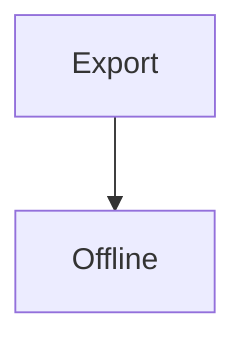

import Card from "./Card"

# Export F Matrix

**Strong**, ~~deleted~~, [link](https://example.invalid/page), and `inline code`.

| Left | Right |
| --- | --- |
| alpha | beta |

- [x] checked task
- [ ] unchecked task

$E=mc^2$

$$
\int_0^1 x^2\,dx = \frac{1}{3}
$$

```swift
let matrixValue = 42
```




<Card>MDX placeholder body</Card>
