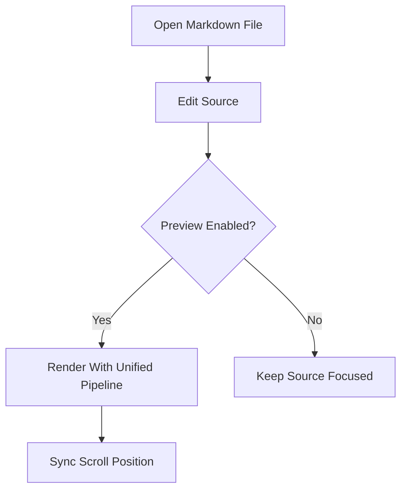
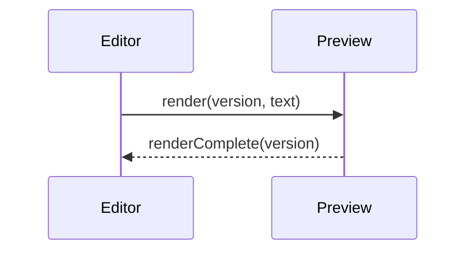

# Kitchen Sink Fixture

This document exercises common Markdown and GFM constructs used by BlogEditor. It is
intended for editor highlighting, preview rendering, scroll sync, and performance smoke
checks.

## Headings

### Third Level

#### Fourth Level

##### Fifth Level

###### Sixth Level

## Emphasis And Inline Spans

Plain text can include **bold**, *italic*, ***bold italic***, ~~strikethrough~~, `inline code`,
and an escaped asterisk like \*this\*. Smart punctuation stays ordinary in source: "quoted
text", `--`, and `...`.

Inline math should remain readable in source and render in preview: $E = mc^2$.

## Links And Images

[Relative Markdown link](./related-post.md)

[External link](https://example.com/blogeditor)


Autolinks should be recognized by GFM: https://example.com and support@example.com.

## Blockquote

> A blockquote can contain **formatting** and a link to [the heading](#headings).
>
> - Nested quoted list item
> - Another quoted list item

## Lists

- Unordered item
- Unordered item with nested content
  - Nested bullet
  - Nested bullet with `inline code`
- Final unordered item

1. Ordered item
2. Ordered item with nested tasks
   - [ ] Draft the section
   - [x] Review the section
3. Ordered item after nested tasks

- [ ] Open the fixture
- [x] Confirm task list highlighting
- [ ] Toggle this item from preview during M2

## Table

| Feature | Syntax | Expected Result |
|---|---:|---|
| Frontmatter | `---` | Parsed as YAML metadata |
| Task list | `- [x]` | Rendered checkbox |
| Table | pipes | GFM table layout |
| Math | `$x$` | KaTeX in preview |

## Fenced Code Blocks

```swift
struct Post: Identifiable {
    let id: UUID
    var title: String
    var draft: Bool
}
```

```javascript
export function wordCount(markdown) {
  return markdown.trim().split(/\s+/u).filter(Boolean).length;
}
```

```typescript
type RenderPayload = {
  version: number;
  fileKind: "md" | "mdx";
  text: string;
};
```

```python
def slugify(title: str) -> str:
    return "-".join(title.lower().split())
```

```bash
set -euo pipefail
swift test
npm test
```

```json
{
  "theme": "github-light",
  "lineNumbers": true,
  "preview": "side-by-side"
}
```

```yaml
title: Nested YAML Fence
tags:
  - fixture
  - yaml
```

```html
<article class="post-card">
  <h2>Rendered HTML Fence</h2>
</article>
```

```css
.post-card {
  border: 1px solid currentColor;
  padding: 1rem;
}
```

## Math

Display math:

$$
\int_{0}^{1} x^2\,dx = \frac{1}{3}
$$

Aligned expression:

$$
\begin{aligned}
a^2 + b^2 &= c^2 \\
\nabla \cdot \vec{E} &= \frac{\rho}{\epsilon_0}
\end{aligned}
$$

## Mermaid





## Horizontal Rule

---

End of fixture.
