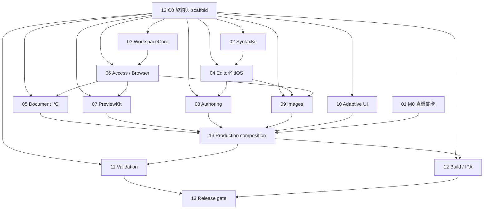

# Plainsong iOS — 平行開發入口

日期：2026-10-08。規格版本：IOS-C0-v1。

本包將核准的 iPhone／iPad、iOS／iPadOS 26 首版拆為 **12 條開發線 + 1 個整合角色**。每份 handoff 都可交給不同 LLM；[啟動提示詞](launch-prompts.md) 可直接複製。C0 另以整合 PR 提供唯一契約與 unavailable scaffold；[台帳](integration-ledger.md) 分列編譯／測試執行／CI／真機狀態，沒有宣稱完整 iOS 功能、真機關卡或 IPA 已完成。

## 先讀與執行順序

1. 每個 LLM 先讀 repository 的 `agent.md`、本頁、[共用契約](contracts.md)，再讀自己的 handoff。
2. 先派 [13 整合角色](handoffs/13-integration.md) 完成 **C0 契約與可編譯 scaffold**。C0 不是產品功能：沒有假 parser、假儲存成功或假權限。
3. [01 M0](handoffs/01-m0-device-spike.md) 可立即開始獨立 spike；其餘開發線可立即做限定範圍的來源調查與測試規劃。C0 一次落地後，12 條線可按凍結介面同時開發，未到位的 provider 使用測試目錄內的 doubles。
4. 模組開發／測試 doubles 與完整 App 整合分開驗收。**M0 的真機 IME、iCloud／Files、背景儲存、自行簽名 IPA 安裝未過，完整 App 的 production composition 不接線。**
5. 每條線交付一個可審查 PR；13 依依賴順序整合，Claude 檢查契約、diff、named tests 和證據。維護者 merge；LLM 不自行 merge。

這個安排依照使用者追加的「同步開發」授權，允許獨立模組與 mock-based 開發先進行；沒有把原先 M0 的實機風險關卡改成已通過。

## 推理／智力等級

等級是本任務所需能力與錯誤代價的評估，不是模型 benchmark，也不依賴某個供應商名稱。

| 等級 | 適合能力 | 使用方式 |
|---|---|---|
| **L4 極高** | 能推導 actor／revision／權限不變量、分析競態與反例、維持原生 IME／Undo、判斷證據是否成立 | 核心作者；使用最高可用推理設定，安排獨立 review |
| **L3 高** | 能讀跨模組程式、依 frozen contract 實作與測試、處理非同步取消和原生 UI 邊界 | 一般模組作者；遇到權限／寫入語意變更交給 L4 review |
| **L2 中** | 能遵循清楚的檔案範圍、參考現有工具、完成可重現 script／UI 組裝 | 邊界明確的工作；重要 shell／簽章流程仍需 L3 review |
| **L1 基礎** | 文件排版、已知資料整理、機械式檢查 | 輔助角色；不獨立負責任何寫入、權限或輸入契約 |

若模型不能自行提出至少一個有意義的失敗反例，不能擔任 L4 工作線作者。L1 可協助整理 11 的測試結果或 12 的安裝說明，不能替代真機測試／簽章驗證。

涉及具體 UIKit／SwiftUI／WebKit／SPM／CLI API 的使用、設定或版本問題時，沿用使用者的 Context7 指示：在 sandbox 外先 `npx ctx7@latest library <官方名稱> "<完整具體問題>"` 取得 ID，再 `npx ctx7@latest docs <libraryId> "<問題>"`，每個問題最多 3 次命令。不得把 keys／credentials 放入 query；quota 或網路問題明示，不能默默以記憶代替 current docs。單純搬檔、business logic、code review 不需要為了關鍵字查 Context7。

## 工作線總表

「依賴」分成開工和實際整合；模組測試 doubles 不能成為 release 的 provider。

| # | 工作線 | 智力 | C0 後可同步做 | production／整合依賴 | 主分支 |
|---|---|---|---|---|---|
| [01](handoffs/01-m0-device-spike.md) | 真機可行性 spike | L4 | 獨立 prototype，無須等 C0 | owner 真機／簽名證據 | `phase3-ios-m0-device-spike` |
| [02](handoffs/02-syntax-kit.md) | 共用 SyntaxKit 與 Mac 相容 | L4 | parser／純 fold 模型抽取與測試 | C0；Mac 回歸 | `phase3-ios-syntax-kit` |
| [03](handoffs/03-workspace-core.md) | 純工作區模型與路徑 | L3 | pure models／Mac sidecar／測試 | C0；Mac 回歸 | `phase3-ios-workspace-core` |
| [04](handoffs/04-editor-kit-ios.md) | UIKit 編輯器、IME、Undo | L4 | engine、guarded commands，fake tokenizer | 02；05 binding；M0 | `phase3-ios-editor-kit-ios` |
| [05](handoffs/05-document-io.md) | UIDocument、儲存與復原 | L4 | save queue／外部更新，fake coordinated access | 03、06；M0 | `phase3-ios-document-io` |
| [06](handoffs/06-workspace-browser.md) | Files、bookmarks、目錄與資源 I/O | L3 | access leases／列舉／資源 provider | 03；M0 | `phase3-ios-workspace-browser` |
| [07](handoffs/07-preview-ios.md) | UIKit PreviewKit 與安全資源讀取 | L4 | UIKit wrapper／bridge／fake asset reader | 06；M0 | `phase3-ios-preview-ios` |
| [08](handoffs/08-authoring-tools.md) | 格式、Frontmatter、Find／Replace | L3 | UI／pure planning，fake editor | 04；05 binding；M0 | `phase3-ios-authoring-tools` |
| [09](handoffs/09-image-insertion.md) | 圖片匯入與交易式插入 | L4 | picker／staging consumer，fake writer/editor | 04、06；05 write state；M0 | `phase3-ios-image-insertion` |
| [10](handoffs/10-adaptive-shell.md) | iPhone／iPad 自適應 UI | L3 | views／navigation，fake services | 04–09；production 接線屬 13 | `phase3-ios-adaptive-shell` |
| [11](handoffs/11-validation.md) | 跨模組驗收、效能、無障礙 | L3 | 測試支援、案例／fixtures、manual scripts | 04–10、12、13；owner 真機 | `phase3-ios-validation` |
| [12](handoffs/12-build-and-ipa.md) | 建置、測試入口、未簽名 IPA | L2 + L3 review | scripts／target wiring／artifact checks | C0；13 production target；owner 重簽 | `phase3-ios-build-and-ipa` |
| [13](handoffs/13-integration.md) | C0、整合與 release gate | L4 | 先做 C0，之後維持 gate／整合台帳 | 按本頁依賴順序收各線 | `phase3-ios-integration` |

## 獨立 worktree 與共同基準

C0 已提供 [固定 tag 與完整 SHA／manifest 交接 receipt](c0-baseline.md)。可依同一基準做獨立模組開發；simulator smoke execution 與 M0 真機仍 OPEN，不能宣稱 C0 全驗收或 production release ready。

本包基於已 live fetch 的 `origin/main`：`b13aa620c7444f2ccd3a8fe3a5b8b0afe0e997b2`。這是 source snapshot，不是 PR／CI 狀態承諾。C0 交付時，13 在台帳記錄新的 **IOS_BASE_REF（可抓取分支／tag／SHA）和精確 IOS_BASE_SHA**；所有線從同一基準建立 worktree。

owner checkout `/Users/davis._.su/Documents/blogeditor` 有 `CLAUDE.md` 與 `.omc/` 的既有工作，不得修改、切分支、stash、format 或在那裡 generate。不得清理其他 worktree。

```sh
# C0 後由整合角色提供實際值。不是可原樣執行的占位 SHA。
git -C /Users/davis._.su/Documents/blogeditor fetch origin
git -C /Users/davis._.su/Documents/blogeditor worktree add \
  /private/tmp/plainsong-ios-<lane> -b phase3-ios-<lane> <IOS_BASE_SHA>
```

若 base 尚未公布，只做來源調查／測試設計。不要各自從最新 `main` 發明另一份 contracts。可抓取 ref 與 SHA 必須對上；無法取得共同基準時不得偷偷換成 local `main`。

## 檔案所有權與交接

| 路徑／檔案 | 唯一作者 |
|---|---|
| `Prototypes/iOSM0/**`、`docs/ios/evidence/m0/**` | 01 |
| `Packages/SyntaxKit/**`、Mac parser／pure fold files／grammar trees、`Packages/EditorKit/Package.swift` | 02；確切 Mac allowlist 見 handoff |
| `Packages/WorkspaceCore/**`、Mac tree/path adapters、`Packages/WorkspaceKit/Package.swift` | 03；確切 allowlist 見 handoff |
| `Packages/EditorKitIOS/**`（排除 frozen `Contracts.swift`） | 04 |
| `Packages/WorkspaceKitIOS/.../Documents/**`、`Recovery/**`、對應 tests | 05 |
| `Packages/WorkspaceKitIOS/.../Access/**`、`Workspace/**`、對應 tests | 06 |
| `Packages/PreviewKit/**`（排除 frozen resource-reader contract） | 07 |
| `AppIOS/Features/Authoring/**`、`AppIOSTests/Authoring/**` | 08 |
| `AppIOS/Features/Images/**`、`AppIOSTests/Images/**` | 09 |
| `AppIOS/UI/**`、`AppIOS/Navigation/**`、`AppIOSTests/Shell/**` | 10 |
| `IOSAcceptanceTests/**`、`docs/ios/evidence/validation/**` | 11 |
| `project.yml`、`Makefile`、`Scripts/ios/**`、`.github/workflows/ios.yml`、build/IPA 文件 | C0 bootstrap 時 13，交接後只由 12 修改 |
| `AppIOS/App/**`、`AppIOS/Composition/**`、`AppIOS/State/**`、`AppIOSTests/Integration/**` | 13 |
| `MarkdownCore` 平台／新增契約、`WorkspaceKitIOS/Package.swift`、所有 frozen contract files（完整索引見 contracts.md §9） | 13 |
| `agent.md`、`docs/decision-log.md`、本包總表／contracts／integration ledger | 13 |
| `Packages/EditorKit/Tests/EditorKitTests/EditorReplaceLayeringTests.swift` | 13；C0 中央 architecture/dependency pin，不改 Replace executor |

若 allowlist 與總表不同，以更窄範圍為準，停下該項修改並交由 13 修正契約；不擴大自己所有權。Package-specific tests 屬 module owner，11 只寫跨模組驗收。依賴 `preview-src` 及 generated bundle 的變更由 07 提案給 13，核准所有權後才做，不能兩條線各自重建 bundle。

13 在 C0 同一 commit 記錄已核准架構與分工的 Decision Log row。各線遵循這些決策；新依賴／架構變更先提交給 13 記錄，不能自行改共有文件造成衝突。每線另有自己的 `docs/ios/evidence/lane-<NN>/**`，供補充 rationale 與驗證結果。

## 依賴與收件順序



箭頭代表實際 provider／release 的整合依賴，不代表箭頭前的 mock-based 作者不能開工。收件按 **02／03 → 04／06／07 → 05／08／09／10 → 13 接線 → 11／12 最終驗收**；01 的真機證據獨立收件。共享文件由上述唯一作者解決整合，禁止 force-push 或自己 merge PR。

## 同一台 Mac 的測試排程

寫程式可同步；**Xcode build、simulator、XCUITest、真機、perf／wall-clock 工作序列化**。共用 `PLAINSONG_XCODEBUILD_LOCK=/private/tmp/plainsong-xcodebuild-test.lock`，重用目前 lock wrapper／`lockf -k`。不要在外層已持鎖時再呼叫持同一鎖的 script。

12 建立穩定入口後，各線使用它，不私自改測試目的地／resource wiring。重型 Swift／JS builds 也不能與宣稱 idle 的效能驗收重疊。CI rerun 綠燈不能代替 race 根因；模擬器 marked-text 測試不能代替真機注音／拼音。

## 每線固定交付格式

- Branch／base SHA／head SHA／PR URL、實際修改路徑與範圍。
- 已實作介面與 frozen contract 版本；尚使用 doubles 的接點。
- Named tests、結果、artifact；失敗反例與 negative mutation probe（適用於安全／競態工作）。
- 已閉關卡、待整合關卡、owner-only 真機關卡分列。
- Claude review 可從 clean checkout 重現的命令；沒有跑的檢查明寫未跑。

## 固定首版邊界

原始碼＋預覽，`.md`／`.markdown`／`.mdx`，frontmatter、圖片、文件內 Find／單次 Replace。iPhone 切換／iPad 寬版並排；資料來自 Files，包括 iCloud Drive。遠端圖片預設關閉、MDX 元件 placeholder、原始 source 唯一真相。

WYSIWYG、跨檔搜尋、全部取代、HTML／PDF、多視窗、MDX 執行及自建雲端後端延後。首版交付未簽名 IPA；不得把「產出檔案」當作「已重簽真機可用」，也不加入付費會員、發布或簽章祕密。
